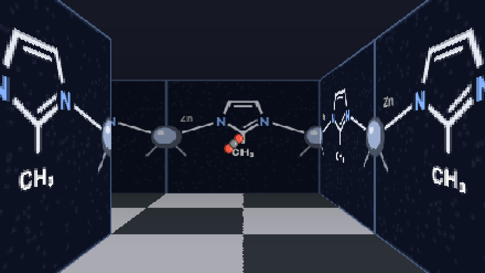
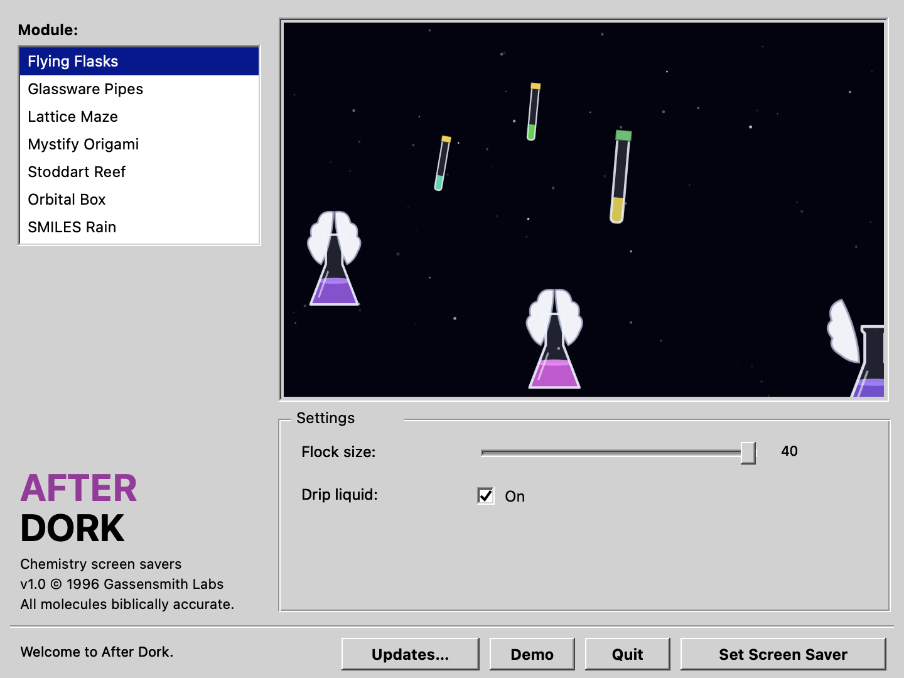
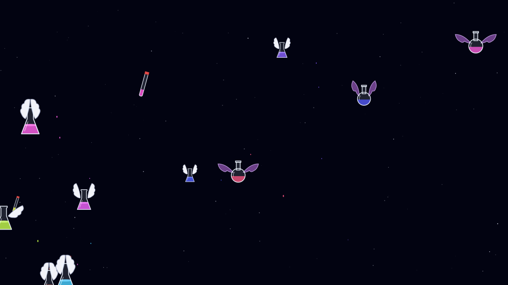
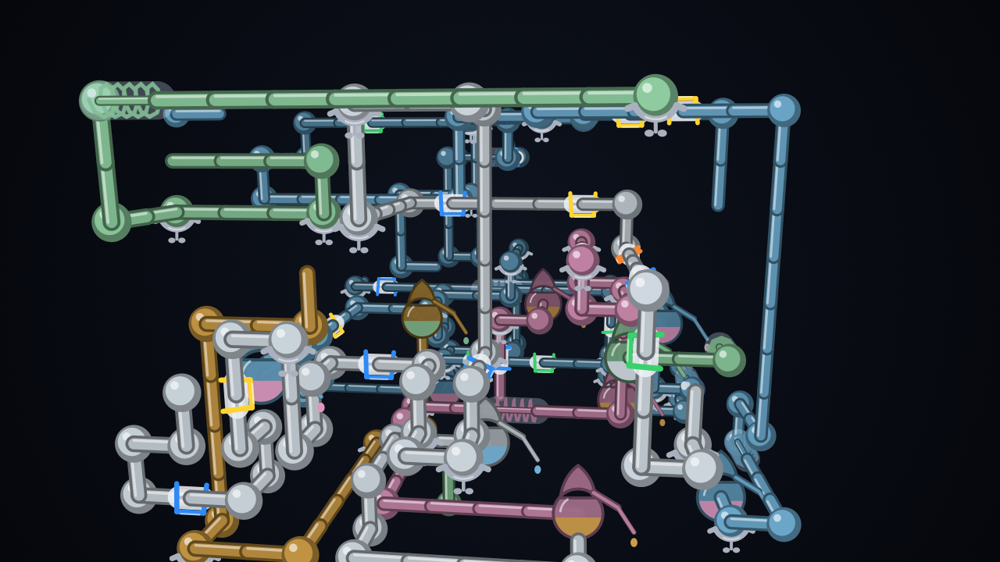
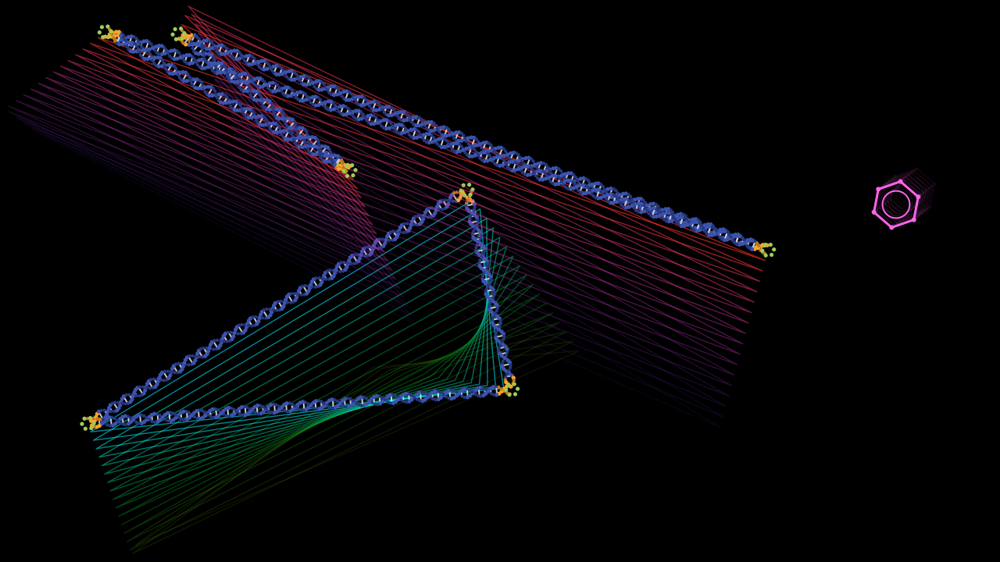
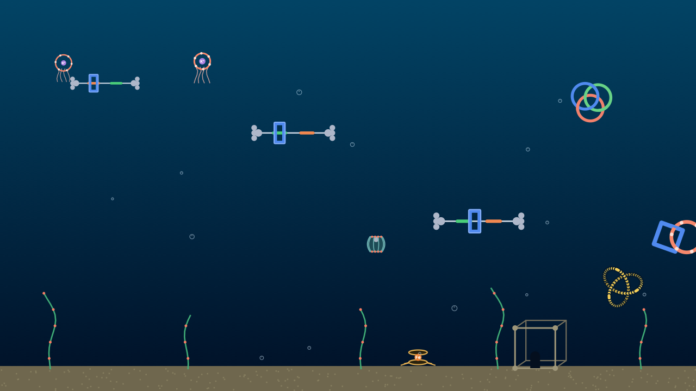
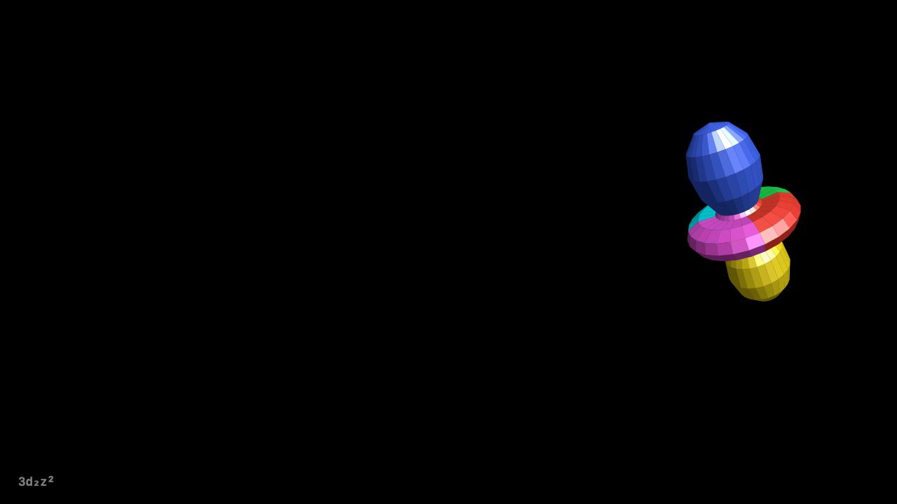
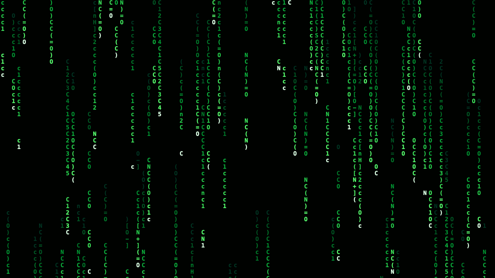
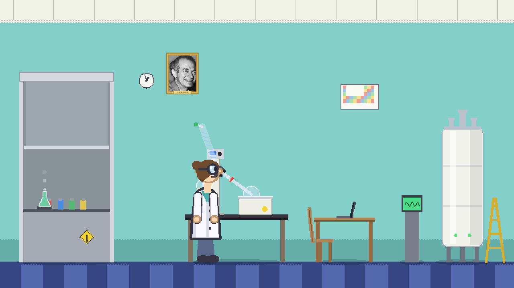

# After Dork

**Chemistry screen savers for the Macintosh, arriving a mere thirty years late.**

In 1996, After Dark gave the world flying toasters and we, as a civilisation,
peaked. Everything since has been decline management. After Dork is an attempt
to claw our way back: eight lovingly hand-programmed screen saver modules in
which the toasters are Erlenmeyer flasks, the pipes are Schlenk lines, and the
maze is a metal–organic framework with — and I cannot stress this enough —
**crystallographically defensible wall art**.



No AI-generated images, no asset packs, no shame. Every pixel is drawn
procedurally in Swift, the way God and Berkeley Systems intended.

---

## Downloading it 

You do not need to know what a "git" is. Follow these steps precisely and
nobody gets hurt:

1. **[Click here](https://github.com/jgassens/after-dork/releases/latest).**
   That's the latest release page.
2. Under **Assets**, click the file called `AfterDork-<version>.zip`. It will
   download. This is the entire crime, about 2 MB. Your phone's photo of last
   night's dinner is larger.
3. Double-click the zip. Out falls **AfterDork.app**.
4. Drag it into your **Applications** folder. (Optional, but you were raised
   properly.)
5. Open it. It will open on the first try, no right-click incantations, no
   "unidentified developer" scoldings — the app is signed and notarised, which
   means Apple has personally inspected every molecule and found them, quote,
   "fine."
6. Pick a module from the list. Fiddle the sliders. Press **Demo** to try it
   full screen right now, or **Set Screen Saver** to make it your actual
   screen saver, forever, until someone in your group meeting asks about it.

Requirements: a Mac running macOS 11 or later, and a willingness to explain
yourself.



Updates install themselves automatically (via Sparkle), so once it's on your
machine it will quietly improve over time, and honestly? That's rare.

---

## The modules

### Flying Flasks
The Flying Toasters homage. Winged Erlenmeyers migrate diagonally across a
starfield, flapping through the original four-pose toaster cycle and dripping
their contents as they go, in flagrant violation of every transport policy
your EHS office has ever written. Capped NMR tubes drift alongside as the
toast. The round-bottom flasks have bat wings. They know what they did.



### Schlenk Pipes
Windows 3D Pipes, except the pipes are borosilicate and the fittings are
correct: ball joints, frosted ground-glass collars held by little plastic Keck
clips, pinch clamps with wing nuts, condenser coils, red-handled stopcocks,
and manifold take-offs with round-bottom flasks plumbed in, stir bars going.
Every line ends the way air-free chemistry ends: in a Schlenk flask, an oil
bubbler burping patiently, or a cold trap sweating frost in its dewar while
a little vacuum pump hums beside it. When the hood fills up, everything is
flushed and the glassware washes itself, a feature not yet available in your
actual lab.



### Lattice Maze
The Windows 95 maze, but you are a guest molecule diffusing through a MOF.
The walls alternate between ZIF-8 districts (2-methylimidazolate bridging Zn
at the canonically zeolitic ~145°) and UiO-66 districts (terephthalate
bridging Zr₆ clusters μ₂-η¹:η¹, *not* chelating, we had a whole thing about
it). CO₂, N₂, H₂, and CH₄ tumble down the corridors. Bump into a stray
solvent molecule and you flip upside down, which is also how solvent effects
work emotionally.

### Mystify Origami
Rigid polygons ricochet around the screen trailing wireframe echoes, exactly
like the original Mystify — except the polygons are DNA nanostructure tiles:
straight bead-chain double helices with orange sticky ends and green
single-stranded connector loops, after the classic tile figures. Yes there is
a benzene ring bouncing around DVD-logo style. Yes it changes colour when it
hits the corner. No, it never quite hits the corner perfectly. Neither do we.



### Stoddart Reef
An After Dark "Fish!"-style aquarium stocked entirely with mechanically
interlocked molecules: bistable rotaxanes with the blue box actively
shuttling between stations, [2]catenanes circumrotating, Borromean rings, a
crown-ether jellyfish with a potassium ion aboard, a [c2]daisy-chain eel, a
cucurbituril with a guest hiding inside, and a ferrocene crab scuttling along
the sand. The castle is a MOF crystal. It has a little door. Sir Fraser, if
you're reading this: they're all swimming beautifully.



### Orbital Box
The 3D Flower Box morphing cube, promoted to quantum mechanics. A chunky
low-poly surface morphs through actual spherical-harmonic magnitudes — 1s,
2p, 3d z², 3d x²–y², 4f z³ — in the original's six shrieking face colours,
spinning and bouncing off the screen edges as required by the Geneva
Conventions. A small caption names the current orbital so you can pretend
watching it is exam revision.



### SMILES Rain
The Matrix digital rain, except the falling glyphs are real SMILES strings of
famous molecules — caffeine, aspirin, TNT, penicillin G, cubane, serotonin —
readable top to bottom by anyone whose brain has been permanently altered by
graduate school. Periodically the saver names one, for the civilians. There
is no stereochemistry in the rain. We removed it. You're welcome.



### Castaway Chemist
Sierra's "Johnny Castaway," relocated from a desert island to the only place
lonelier: a working lab. A grad student shuffles between the fume hood, the
rotovap, and the NMR while the lab does what labs do — the hood detonates in
colored smoke, the rotovap drops its flask into the bath, and the magnet
either quenches in a pillar of helium fog or returns their sample at escape
velocity. Some days they wheel in a gas cylinder on a dolly for a refill —
an operation containing two coin flips, either of which can end with
something very heavy flying around the lab. The NMR tubes stuck in the ceiling stay there, a permanent record
of their sins. Between disasters they type the thesis at the corner desk
until sleep wins, Z's stacking toward the ceiling. The wall clock spins
through the years of the PhD. They are never getting out.



---

## Frequently asked questions

**Will this help my career?**
It will not hurt your career in any way we are prepared to discuss.

**Is the chemistry accurate?**
Distressingly. The Kevlar got sent back twice. The UiO-66 carboxylates were
made to bridge, not chelate. The imidazolate angle is 145°. This README is
the closest any of it will come to peer review, and it's passing.

**My screensaver settings look weird / macOS is being strange.**
Modern macOS moved screen savers into the Wallpaper settings and the legacy
screen saver engine is, in the technical sense, haunted. After Dork routes
around all of it: press **Set Screen Saver** in the app and it does the
paperwork directly. If macOS still sulks, press it again, harder.

**Can I get just the .saver files like a person from the past?**
The app "quietly" installs the module you set into `~/Library/Screen Savers`,
where System Settings can also see it. Or build them all from source, below.

**Who is responsible for this?**
The [Gassensmith Lab](https://www.gassensmithlab.com) energy, a
regrettable amount of 90s nostalgia, and a programmer who said
"make the flasks flap like the original toasters" to Clod and Clod simply did it.
Then we went a little nuts.

---

## Building from source (nerds' entrance)

```sh
git clone https://github.com/jgassens/after-dork.git
cd after-dork
make app        # build/AfterDork.app with all eight modules inside
make            # or: just the .saver bundles
make install    # copy savers to ~/Library/Screen Savers
make previews   # render PNG frames offscreen for tinkering
```

No Xcode project. No asset catalogue. One Makefile, eight `ScreenSaverView`
subclasses, a software raycaster, and the conviction that 1996 was right
about UI design. `make release` (maintainer only) signs, notarises, staples,
publishes the GitHub release, and regenerates the Sparkle appcast.

| Saver | Parody of | Options |
|---|---|---|
| Flying Flasks | After Dark "Flying Toasters" | flock size, drips |
| Schlenk Pipes | Windows "3D Pipes" | growth speed, fancy glassware |
| Lattice Maze | Windows 95 "3D Maze" | crawl speed, gas molecules |
| Mystify Origami | Windows "Mystify" | speed, echo depth |
| Stoddart Reef | After Dark "Fish!" | population, bubbles |
| Orbital Box | Windows "3D Flower Box" | spin speed, morph speed |
| SMILES Rain | The Matrix | rain speed, name reveals |
| Castaway Chemist | Sierra "Johnny Castaway" | chaos, NMR quenches |

MIT licensed. © 1996, emotionally. All molecules biblically accurate.
